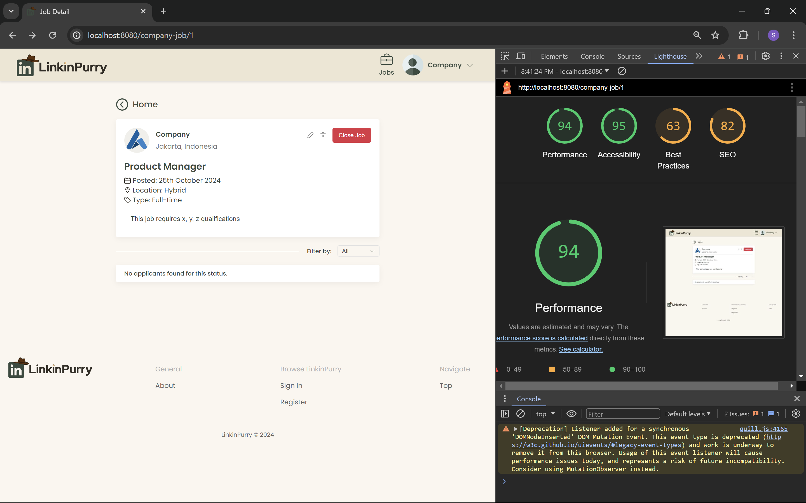

# Tugas Besar IF3110 2024/2025

<a id="readme-top"></a>
<br />
<div align="center">
    
    <h3>LinkinPurry – Your Bridge to Opportunity</h3>
</div>

<details>
  <summary>Table of Contents</summary>
  <ol>
    <li>
      <a href="#about-the-project">About The Project</a>
    </li>
    <li>
      <a href="#getting-started">Getting Started</a>
      <ul>
        <li><a href="#prerequisites">Prerequisites</a></li>
        <li><a href="#installation">Installation</a></li>
      </ul>
    </li>
    <li><a href="#results">Results</a></li>
    <li><a href="#contributors">Contributors</a></li>
    <li><a href="#tasks-allocation">Tasks Allocation</a></li>
  </ol>
</details>

## About The Project

LinkinPurry is a platform designed to connect job seekers with the right job opportunities and empower companies to upload and manage job listings effortlessly. Inspired by Purry the Platypus and the challenges faced by the agents of O.W.C.A., LinkinPurry serves as a solution to bridge the gap between those seeking employment and organizations offering exciting career prospects.

At LinkinPurry, we are dedicated to making the job search and recruitment experience smooth, efficient, and successful for both individuals and businesses. Our platform offers key features such as job search filtering, easy job listing management, and a user-friendly interface, ensuring an optimal experience for all users.

Whether you’re a job seeker looking for the perfect role or a company seeking top talent, LinkinPurry is here to support you every step of the way.

<p align="right">(<a href="#readme-top">back to top</a>)</p>

## Getting Started

To access this web locally on your device, there are some prerequisites and installation steps you need to follow.

### Prerequisites

1. Docker: Install Docker Desktop on your device
<br>Refer to Docker's official installation guide for your operating system.</br>

### Installation

1. Clone this repository
<br>Begin by cloning the project repository from GitHub:</br>
   ```sh
   git clone https://github.com/Labpro-21/if3110-tubes-2024-k02-19
   ```
2. Launch Docker Desktop
<br>Ensure that Docker Desktop is installed and running on your machine.</br>
3. Establish connection to the database
<br>Use the following command to build and run the Docker containers, which include the application and database</br>
   ```sh
   docker compose up --build
   ```
4. Access the Application
<br>Once the Docker containers are running, open your web browser and navigate to:</br>
    ```sh
    localhost:8080
    ```

<p align="right">(<a href="#readme-top">back to top</a>)</p>

## Results
1. Home - Not Logged in


2. Log In


3. Sign In


4. Home - Jobseeker


5. Job Detail - Jobseeker


6. Applications Page


7. Application History


8. Profile - Job Seeker


9. Edit Profile - Job Seeker


10. Company Profile - Job Seeker


11. Home - Company


12. Add Job


13. Job Detail - Company


14. Edit Job


15. Application Detail


16. Profile - Company


17. Edit Profile - Company


18. About


<p align="right">(<a href="#readme-top">back to top</a>)</p>

<table>
  <tr>
    <td style="text-align: center;">
      
      <p>Salsabiila</p>
      <p>13522062</p>
    </td>
    <td style="text-align: center;">
      
      <p>Randy Verdian</p>
      <p>13522067</p>
    </td>
    <td style="text-align: center;">
      
      <p>Juan Alfred Widjaya</p>
      <p>13522073</p>
    </td>
  </tr>
</table>

<p align="right">(<a href="#readme-top">back to top</a>)</p>

## Tasks Allocation
1. **Server-side**  
   - Login: 13522067  
   - Register: 13522067  
   - Navbar: 13522073  
   - Footer: 13522067  
   - About: 13522062  

    Company 
   - Home: 13522073  
   - Add Job: 13522073  
   - Job Detail: 13522073  
   - Edit Job: 13522073  
   - Application Detail: 13522073  
   - Profile: 13522062  
   - Edit Profile: 13522062  

    Job Seeker 
   - Home: 13522073  
   - Job Detail: 13522067  
   - Company Profile: 13522062  
   - Application Page: 13522067  
   - Application History: 13522067  
   - Profile: 13522062  
   - Edit Profile: 13522062

2. **Client-side**
   - Login: 13522067  
   - Register: 13522067  
   - Navbar: 13522073  
   - Footer: 13522067  
   - About: 13522062  

    Company  
   - Home: 13522073  
   - Add Job: 13522073  
   - Job Detail: 13522073  
   - Edit Job: 13522073  
   - Application Detail: 13522073  
   - Profile: 13522062  
   - Edit Profile: 13522062  

    Job Seeker  
   - Home: 13522073  
   - Job Detail: 13522067  
   - Company Profile: 13522062  
   - Application Page: 13522067  
   - Application History: 13522067  
   - Profile: 13522062  
   - Edit Profile: 13522062

<p align="right">(<a href="#readme-top">back to top</a>)</p>